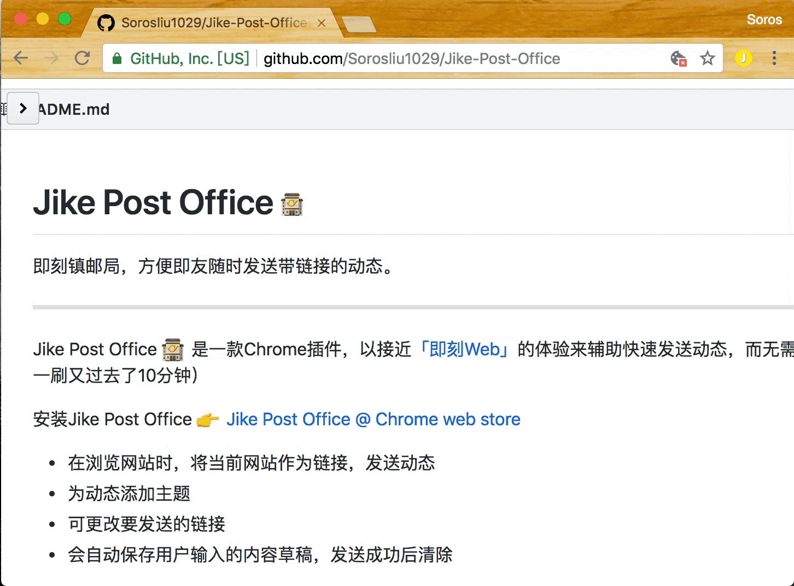

# Jike Post Office 🏤

即刻镇邮局，方便即友随时发送带链接的动态。

----

Jike Post Office 🏤 是一款Chrome插件，以接近[「即刻Web」](http://web.okjike.com)的体验来辅助快速发送动态，而无需打开「即刻Web」端（刷一刷又过去了10分钟）

安装Jike Post Office 👉 [Jike Post Office @ Chrome web store](https://chrome.google.com/webstore/detail/jike-post-office/eojcocifcbbffhcfjpcdmfmffpolaaco)

- 在浏览网站时，将当前网站作为链接，发送动态
- 为动态添加主题
- 可更改要发送的链接
- 会自动保存用户输入的内容草稿，发送成功后清除

Demo Gif:

PS：

- 不支持上传图片，也不会考虑这个需求。如有需要，请使用「即刻Web」端。
- 非官方插件